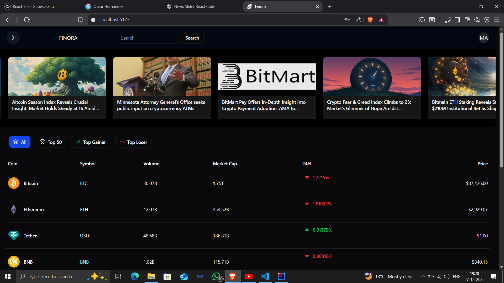
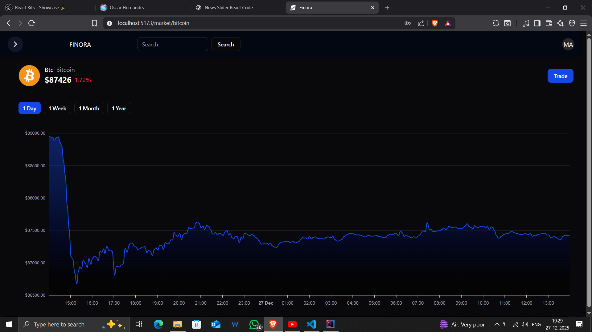
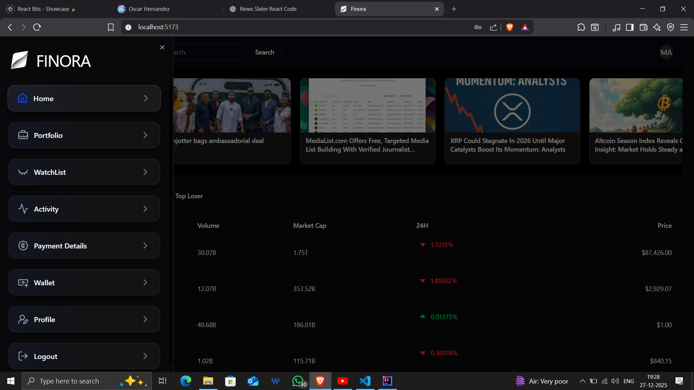
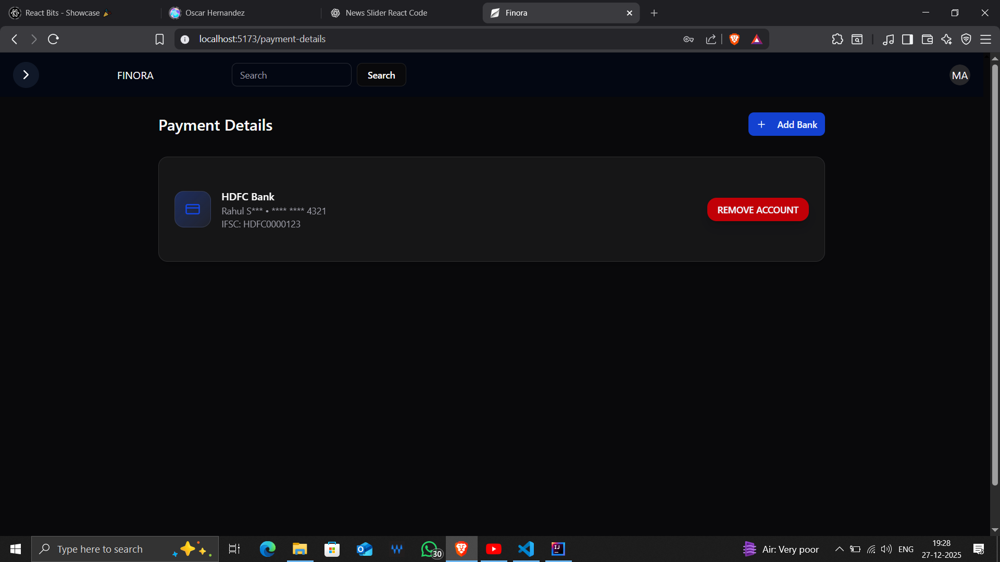
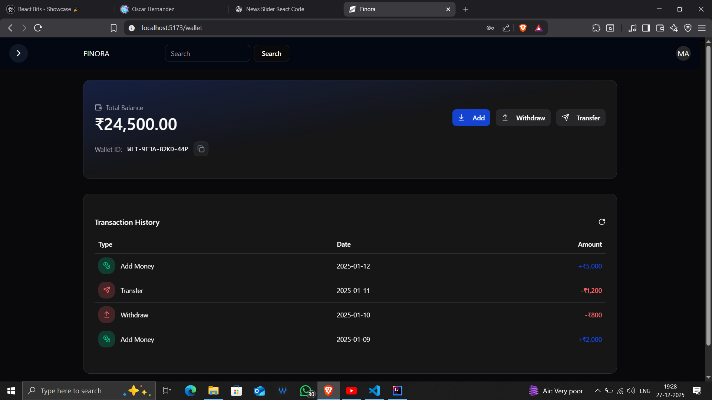

# 🪙 Finora – Modern Crypto Trading Platform

**Finora** is a secure cryptocurrency trading platform that allows users to **track, trade, and manage digital assets** in real-time with wallet support, live trading, and secure transactions.

---

## 📸 Screenshots

### 🏠 Home / Dashboard

  

---

### 💹 Trading Page

  

---

### 📋 Sidebar Navigation

  

---

### 🏦 Bank / Payment Details

  

---

### 🔄 Transfer Funds

  

---
## 🚀 Features

- 📊 Live crypto price tracking  
- 📈 Interactive charts (ApexCharts)  
- 💼 Portfolio & wallet management  
- ⚡ Instant buy/sell trading  
- 💳 Deposit & withdrawal system  
- 🔍 Search and filter coins  
- 🎨 Modern UI (Shadcn + Tailwind)  
- 🔐 Secure backend (Spring Boot + JWT)  

---

## ⚙️ Architecture & Messaging

### 🔄 Apache Kafka (Event Streaming)

Kafka is used to **decouple services** and handle asynchronous operations:

- 💳 Payment processing decoupling  
- 🔄 Transaction updates via events  
- 📧 Email notification service (alerts, confirmations)  

---

### ⚡ Redis (Caching & Performance)

Redis is used for **fast data access and caching**:

- 🏦 Bank account details caching  
- 💰 Transaction amount handling  
- 👤 User data caching  

---

## 🛠 Tech Stack

**Frontend:** React, JavaScript, TailwindCSS, Shadcn UI  
**Backend:** Spring Boot, Spring Security, JWT  
**Database:** PostgreSQL / MySQL  
**Messaging:** Apache Kafka  
**Caching:** Redis  
**Charts:** ApexCharts  
**APIs:** CoinGecko, Alpha Vantage  

---

